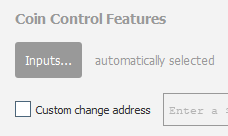

### Preparing collateral

1. Open your wallet and wait for it to synchronize
2. Use **Tools > Debug** to open the debug console.
3. Type the following command to create a new address you control and label it "MN1": `getaccountaddress "MN1"`
4. Now send the exact amount needed for the masternode to the above address. 
  Do not subtract fees from this amount. The amount sent must be exactly the specified amount. 
5. You will see the transaction in your wallet is negative a small amount. This is normal.
6. Once you have 15 confirmations on this transaction you are ready to start your Masternode!

### Preparing collateral for multiple Masternodes
If you are preparing collateral for more than 1 master node you need to lock the coins used prior to sending collateral for the next nodes. 

After you send the coins for the first Masternode. 
1. Goto the **Send** section of the wallet
2. You should see "Coin Control Features". If you do not see this enable it in **Settings > Options > Wallet**

    
3. Click **Inputs** to go into coin control
4. Click on the coins for your Masternode and use toggle lock state to lock the coins
5. Follow the instructions above and this instructions for the rest of your Masternodes

[< Home](README.md)
